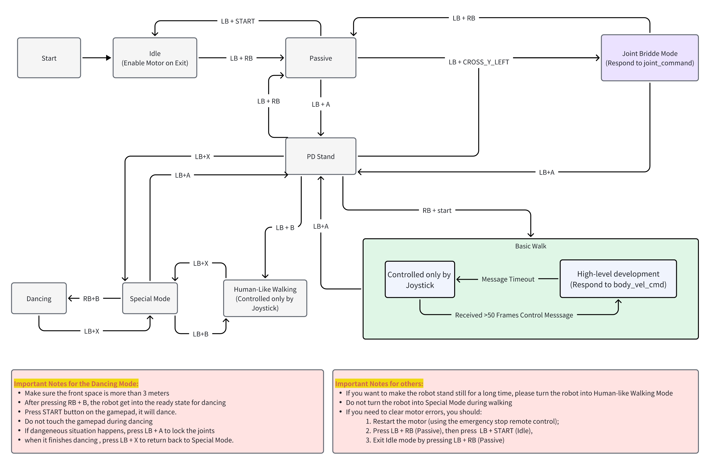
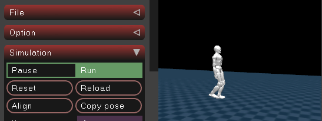

# EngineAI ROS:  Development Guide with ROS2 Interface for EngineAI Robot


## Overview

EngineAI ROS is a ROS2 package that provides a set of ROS2 nodes and tools for the EngineAI robot. It offers two types of development modes: high-level development and low-level development.

High-level development allows the user to use EngineAI's walking controller by publishing the body velocity command.

Low-level development allows the user to develop their own controller by publishing the joint command.


## ROS2 Interface Protocol
[Interface Protocol Description](src/interface_protocol/README.md)

## Architecture 

### Computing Units
The EngineAI ROS package is designed to run on both of the computing units, with the following architecture:
|Computer Name|Architecture|Description|
|---|---|---|
|Nezha|X86|High-frequency computer, responsible for motion control and data processing|
|Jetson Orin|ARM|Embedded AI computer, responsible for application functionality|

Both computing units are maintained as open platforms by EngineAI.

### Connect to the computer
| Device | IP | SSH Username | SSH Password |
| --- | --- | --- | --- |
| Nezha | 192.168.0.163 | user | 1 |
| Jetson Orin | 192.168.0.162 | ubuntu | ubuntu |

### Workspace Structure
```bash
└── src
    ├── interface_example # Interface examples, recommended to run on Nezha
    ├── interface_protocol # Interface protocols, common modules
    ├── third_party # Third-party libraries
    ├── simulation # Simulation environment running on host
```

## Build & Run

### Development Environment Requirements for Your Host PC
#### Basic Environment
- Ubuntu 22.04
- ROS2 Humble Desktop
- GCC >= 11
- CMake >= 3.22
- Python >= 3.10
#### Software Dependencies
```
sudo apt update
sudo apt install rsync sshpass openssh-client libglfw3-dev libxinerama-dev libxcursor-dev
sudo apt install ros-dev-tools ros-humble-rmw-cyclonedds-cpp ros-humble-ros-base
```

#### Environment Variables
Add these environment variables to your ~/.bashrc :
```bash
echo -e '\nexport ROS_DOMAIN_ID=69\nexport ROS_LOCALHOST_ONLY=0\nexport RMW_IMPLEMENTATION=rmw_cyclonedds_cpp' >> ~/.bashrc && source ~/.bashrc
```

### Finite State Machine(FSM) for the Development Mode
Normally, a default process is running. Users can control the robot with EngineAI's Joystick(default Logitech F710). This is called the Joystick Mode.

The FSM which includes Joystick Mode, High-level development and Low-level development is depicted as follows, please check through carefully to safely activate the specific mode.



### Joystick Control
Joystick Control is the simplest mode with which the user can enjoy the default motion offered by EngineAI. Please follow the directions below carefully.
1. get the robot out of the case, make sure the robot hangs on a portable gantry or lay on the ground
2. shortly press the battery button, and then long press it again until the four led lights of the battery are enlightened.
3. wait for 1 minute so that the auto-start of default EngineAI application is finished.
4. press LB + RB to enable the motors
5. press LB + A to turn into pd-stand mode, and now you can put the robot on the ground. Please make sure the ground is flat enough.
6. Follow the FSM flow chart to enjoy the other functions. Do not activate the Joint Bridge Mode(Low-level Development) and the High-level Development Mode.

### Connect to the robot
#### Simulator
```bash
# in host
# terminal 1
./src/third_party/install.sh
./scripts/build_nodes.sh sim
source install/setup.bash
ros2 launch mujoco_simulator mujoco_simulator.launch.py
```
> **IMPORTANT**: When running simulation, either do not connect to the physical robot or set `ROS_LOCALHOST_ONLY=1` in your environment to prevent accidental connections.

#### Real robot
Connect to the robot network by Ethernet
   - Configure your network segment to 192.168.0.0/24. You can use the following command to check the network status:
   ```bash
   # in host
   ping 192.168.0.163
   ```
> **WARNING**: Do not use USB network cards as they may cause ROS2 communication issues. Use built-in Ethernet ports for reliable communication with the robot.
### High-level Development
#### Body Velocity Control Example
1. Enter Basic Walk mode(Refer to the FSM flow chart)
2. Run the example

```
# in host
./scripts/build_nodes.sh example
source install/setup.bash
python src/interface_example/scripts/body_velocity_control_example.py
```
### Low-level Development

Low-level development allows the user to use their own RL controllers trained with EngineAI's open-source RL training framework https://github.com/engineai-robotics/engineai_gym. The user can follow the directions below step by step to realize sim2sim functionality with the Mujoco simulator and deployment. 

By default, a simple policy is loaded from the directory of ```src/interface_example/config/pm01/rl_basic/basic/policies/pm01_v2_rough_ppo_42obs.mnn ```. It can realize a simple walk. Users can replace it with their own one generated with our open-source training framework.

#### Deploy: Run the rl_basic_example on your host
1. Enter pd-stand mode
   - Ensure the robot is securely positioned on flat ground with sufficient space around it
   - Use the remote control to enter pd-stand mode
   - Make sure the robot is stable and standing properly before proceeding

2. Enter joint bridge mode
   - Joint bridge mode allows control via joint commands
   - With the robot in pd-stand mode, press the remote control [LB, CROSS_Y_LEFT] combination
   - The robot will enter joint bridge mode, which allows control via joint commands
   - Verify the robot status with the following command:
   ```bash
   # in host
   ros2 topic echo /motion/motion_state
   ```
   - Confirm that the motion state is `joint_bridge` before proceeding

3. Run the RL example
   - **SAFETY WARNING**: Ensure all personnel stand at a safe distance from the robot
   - Be prepared to stop the robot quickly if it behaves unexpectedly（pressing the emergency stop button or entering passive mode）
   - Launch the example with:
   ```bash
   # in host
   ros2 launch interface_example rl_basic_example.launch.py
   ```

> **NOTE**: If the robot falls during simulation, you may need to reset the simulator by pressing the reset button.



### Compile the code on the target board
If you don't have the PC development environment, you can compile the code on the target board.

#### Sync the code to Board
```bash
# in host
./scripts/sync_src.sh nezha
```

#### Build the workspace

First, ssh into the Nezha board and enter the workspace directory:
```bash
# in nezha
cd ~/source/engineai_workspace
./scripts/build_nodes.sh
```

### Run PlotJuggler for data monitoring
```bash
# in host
colcon build --packages-select interface_protocol
source install/setup.bash
ros2 run plotjuggler plotjuggler -n
```
A default layout file is in `src/interface_protocol/pm_data_layout.xml`

## Get the latest firmware of EngineAI Robot
Refer to the [EngineAI Firmware](https://github.com/engineai-robotics/engineai_firmware) repository for the latest firmware.